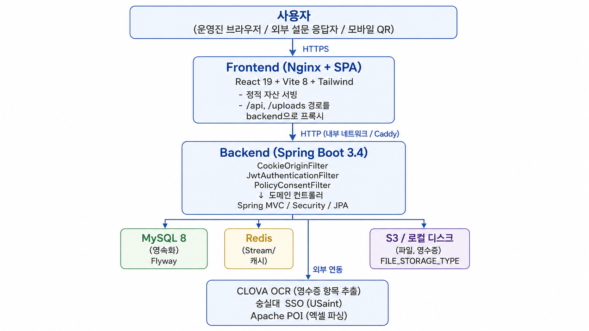
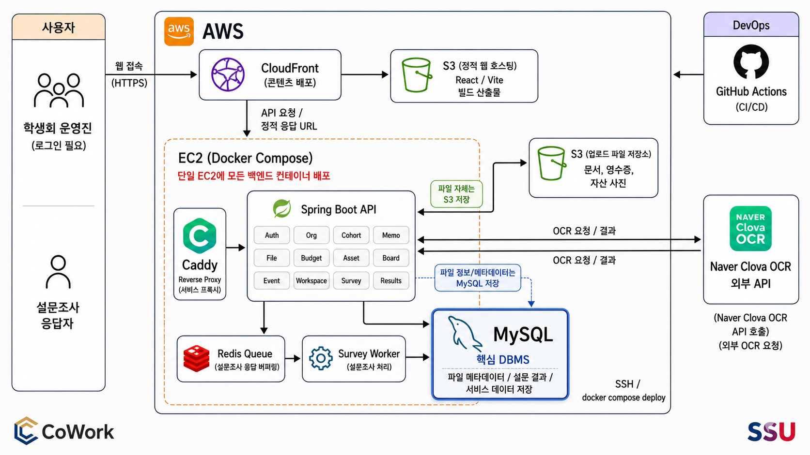
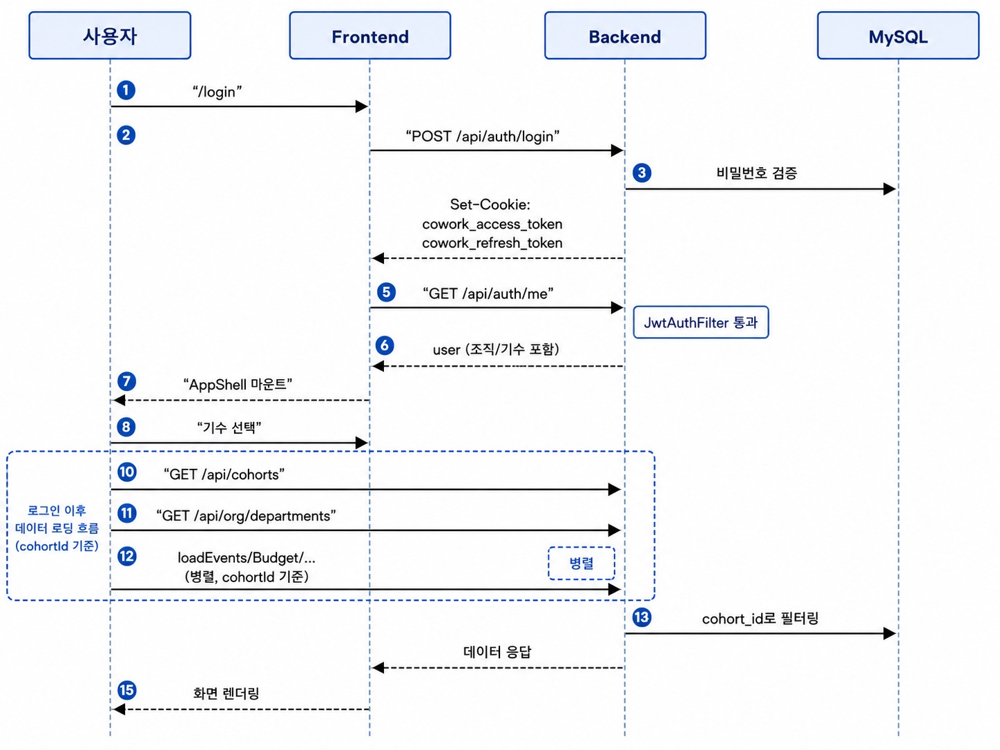

# Cowork

**Cowork는 학생회 행정 업무를 행사 중심으로 구조화하는 통합 협업 플랫폼입니다.**

학생회, 동아리, 운영진처럼 여러 사람이 함께 조직을 운영할 때 필요한 업무를 한곳에서 관리합니다.

학생회 업무는 회의, 공지, 정산, 설문, 일정 조율, 파일 관리처럼 여러 기능으로 나뉘어 보이지만, 실제 운영 과정에서는 많은 업무가 하나의 **행사**를 중심으로 발생합니다. 예를 들어 MT 하나만 보더라도 기획안, 예산안, 지출 내역, 영수증, 행사 사진, 결산 보고서가 모두 연결됩니다.

즉, 학생회 업무는 단순히 개별 파일을 저장하는 문제가 아니라, 하나의 행사와 관련된 여러 데이터를 연결하고 추적하는 문제입니다.

Cowork는 이러한 학생회 행정 데이터를 `조직 -> 기수 -> 기능별 데이터` 구조로 정리하고, 특히 행사와 연결된 예산, 파일, 회의록, 설문, 일정, 지출 증빙을 하나의 흐름 안에서 관리할 수 있도록 설계되었습니다.

---

## 목차

1. [프로젝트 소개](#1-프로젝트-소개)
2. [문제 정의 및 개발 목적](#2-문제-정의-및-개발-목적)
3. [시스템 아키텍처](#3-시스템-아키텍처)
4. [주요 기능](#4-주요-기능)
5. [데이터 모델](#5-데이터-모델)
6. [인증과 보안](#6-인증과-보안)
7. [Backend 상세](#7-backend-상세)
8. [Frontend 상세](#8-frontend-상세)
9. [기술 스택](#9-기술-스택)
10. [디렉토리 구조](#10-디렉토리-구조)
11. [실행 방법](#11-실행-방법)
12. [환경 변수 레퍼런스](#12-환경-변수-레퍼런스)
13. [배포 구성](#13-배포-구성)

---

## 1. 프로젝트 소개

Cowork는 단체 운영진을 위한 협업 관리 플랫폼입니다.

운영진은 하나의 조직에 속하고, 조직 안에서 연도/기수 단위의 코호트를 만들어 데이터를 관리합니다. 각 코호트에는 학생 명단, 행사, 회의록, 파일, 예산, 설문, 일정 조율표, 자산 대여 기록 등이 연결됩니다.

이 프로젝트의 핵심 관점은 **학생회 업무를 파일 단위가 아니라 행사 기반 워크플로우로 바라보는 것**입니다.

기존 학생회 업무에서는 행사 기획안은 노션에 작성하고, 파일은 구글 드라이브에 저장하며, 지출 내역은 엑셀에 기록하고, 영수증이나 증빙 사진은 카카오톡으로 주고받는 경우가 많습니다. 각각의 도구는 편리하지만, 학생회 행정에서는 이 데이터들이 서로 연결되어 있지 않다는 점이 큰 문제가 됩니다.

Cowork는 흩어진 자료를 단순히 한곳에 모으는 것을 넘어, 행사·예산·지출·영수증·파일·설문·일정을 하나의 데이터 흐름으로 연결합니다. 이를 통해 운영진은 특정 행사와 관련된 자료를 한 화면에서 확인하고, 업무 진행 상태와 누락된 자료를 추적하며, 기수가 바뀌어도 안정적으로 데이터를 인수인계할 수 있습니다.

이 저장소는 다음 두 컴포넌트를 함께 관리합니다.

- **Backend** — JWT 기반 회원가입/로그인, SSO 온보딩, 쿠키 인증, 조직·기수·구성원·부서 관리, 행사·사진·파일·회의록·메모 관리, 학생 명부 및 회비 납부 상태 관리, 예산 지출·영수증 OCR·통장 내역 매칭, 설문 생성/응답/집계, 일정 조율표 생성/응답/집계, 자산 등록/대여/반납 이력 관리를 담당하는 Spring Boot API 서버
- **Frontend** — 위 도메인을 운영진이 한 화면에서 다룰 수 있게 하는 React SPA. 로그인부터 행사·예산·설문·일정 조율·QR 영수증·외부 응답 페이지까지 모든 UI 제공

### 1.1 핵심 개념

| 개념 | 설명 |
| --- | --- |
| **Organization** | 학생회 단위. 최초 가입자가 조직을 생성하거나, 기존 조직의 초대 코드로 가입 |
| **Cohort** | 조직 내 기수/연도 단위 데이터 그룹. 모든 운영 데이터는 특정 Cohort에 속함 |
| **Department** | 조직별 커스텀 부서 (`회장단`은 기본 보장) |
| **User** | 로그인 가능한 운영진 계정. 가입 후 `PENDING → ACTIVE` 상태 |
| **Student** | 회비 관리 대상 학생 명부. `users`와 분리되어 로그인 계정이 없는 사람도 관리 |
| **Role** | `ADMIN` / `EDITOR` / `VIEWER` — 기수 단위로 부여 |
| **Event** | 행사 단위 워크플로우의 중심 엔티티. 예산, 지출, 파일, 사진, 설문, 일정 등이 연결됨 |

## 2. 문제 정의 및 개발 목적

학생회나 운영진 업무는 보통 카카오톡, 구글폼, 엑셀, 드라이브, 개인 메모에 나뉘어 관리됩니다. 처음에는 각 도구를 편하게 사용할 수 있지만, 시간이 지나면 데이터가 흩어지고 업무 흐름이 끊기는 문제가 발생합니다.

예를 들어 하나의 행사를 진행할 때도 기획안은 문서 도구에, 예산안과 지출 내역은 엑셀에, 영수증과 증빙 사진은 메신저에, 행사 사진과 첨부 파일은 드라이브에 따로 저장됩니다. 이 경우 운영진은 필요한 자료를 매번 여러 플랫폼에서 다시 찾아야 하고, 어떤 자료가 누락되었는지 확인하기 어렵습니다.

특히 학생회 행정은 단순 기록보다 **연결성과 추적 가능성**이 중요합니다. 행사별 예산, 회의록, 사진, 설문, 파일, 지출 내역이 서로 연결되지 않으면 감사 준비, 결산 보고, 인수인계 과정에서 반복적인 수작업이 발생합니다.

기존 방식에서 발생하는 주요 문제는 다음과 같습니다.

- 행사별 예산, 회의록, 사진, 설문, 파일이 서로 연결되지 않음
- 회비 납부 여부나 자산 대여 상태를 매번 수동으로 확인해야 함
- 기수가 바뀔 때 기존 자료를 이어받기 어렵고 인수인계가 불안정함
- 영수증, 통장 내역, 지출 기록을 사람이 직접 맞춰야 해서 실수가 잦음
- 자료 누락 여부를 감사 직전이나 결산 시점에야 발견하는 경우가 많음
- 공용 계정이나 공용 PC 사용으로 인해 작성자, 수정자, 수정 시점이 명확하지 않음
- 공개 설문/일정 응답과 관리자용 기능의 권한 구분이 필요함

이 프로젝트의 목적은 운영진의 반복 업무를 줄이고, 조직 운영 데이터를 기수 단위로 안정적으로 남기는 것입니다.

Cowork는 단순 CRUD 시스템이 아니라, 학생회 업무를 데이터베이스 기반으로 구조화하는 것을 목표로 합니다. 행사와 관련된 설문·일정·지출·파일을 함께 묶고, OCR/엑셀 업로드/Redis 큐/S3 저장소처럼 실제 운영에 필요한 기능까지 고려했습니다.

이를 통해 Cowork는 사람의 기억과 흩어진 파일에 의존하던 운영 방식을, 시스템에 기록되고 추적 가능한 조직 운영 방식으로 전환합니다.

## 3. 시스템 아키텍처

### 3.1 컴포넌트 다이어그램

사용자(브라우저/외부 응답자/모바일 QR) → Frontend(Nginx + React SPA) → Backend(Spring Boot) → MySQL / Redis / S3·로컬 디스크 → 외부 연동(CLOVA OCR, USaint SSO, Apache POI) 구조입니다.



### 3.2 인프라 아키텍처

운영 환경은 AWS EC2 위에서 Docker Compose로 Caddy + Spring Boot + Redis + MySQL을 띄우고, 정적 자산은 S3 + CloudFront로, 업로드 파일·영수증은 별도 S3 버킷으로 분리합니다. 배포는 GitHub Actions로, OCR은 Naver CLOVA OCR을 호출합니다.



### 3.3 디플로이먼트 단위

| 서비스 | 컨테이너 | 포트 | 역할 |
| --- | --- | --- | --- |
| `frontend` | `nginx:1.27-alpine` | 80 | SPA 서빙 + `/api`, `/uploads` 프록시 |
| `backend` (app) | `eclipse-temurin:17-jre` | 8080 | Spring Boot API. JWT/쿠키 인증, 도메인 API, OCR/엑셀/파일 처리 |
| `mysql` | `mysql:8.4` (루트), `mysql:8.0` (Backend 단독) | 3306 | 운영 데이터 영속화. Flyway로 스키마 마이그레이션 |
| `redis` | `redis:7-alpine` | 6379 | 설문 응답 큐(Redis Stream), 캐시. AOF 영속화, 최대 64MB |
| `caddy` | `caddy:2-alpine` | 80/443 | Backend 단독 배포 시 리버스 프록시 + 자동 HTTPS |
| `s3` (외부) | AWS | 443 | 파일/사진/영수증 저장. `FILE_STORAGE_TYPE=local`이면 로컬 디스크로 대체 |

루트의 `docker-compose.yml`은 MySQL과 Backend를 한 네트워크(`cowork-net`)에 띄웁니다. Backend 디렉토리에는 인프라(`Backend/docker-compose.yml` — MySQL+Redis)와 앱 배포(`Backend/docker-compose.app.yml` — app+Caddy)를 분리한 컴포즈 파일이 별도로 있어 운영 환경에서 단계적으로 띄울 수 있습니다.

### 3.4 로그인 → 화면 데이터 로딩 시퀀스



Access Token이 만료되면 백엔드가 401을 반환하고, 프론트의 `apiRequest`가 자동으로 `/api/auth/refresh`를 1회 시도 후 원 요청을 재실행합니다. 재발급마저 실패하면 `AUTH_SESSION_EXPIRED_EVENT`를 발행해 라우터가 `/login`으로 이동시킵니다.

### 3.5 외부 참여자 흐름

설문 응답, 일정 조율 응답, 모바일 영수증 등록은 인증 없이 접근하는 공개 흐름입니다. 백엔드(`SecurityConfig`)와 프론트(`RequireAuth` 바깥 라우트)에서 모두 공개로 설정되어 있습니다.

| 흐름 | 진입 URL | 백엔드 공개 엔드포인트 |
| --- | --- | --- |
| 설문 응답 | `/surveys/:surveyId/respond` | `GET/POST /api/surveys/{id}`, `POST /api/surveys/{id}/respond` |
| 일정 조율 응답 | `/schedules/:pollId/respond` | `GET /api/timetables/{id}`, `POST /api/timetables/{id}/respond` |
| 모바일 영수증 등록 | `/budget/mobile-register/:token` | `GET/POST /api/mobile/sessions/{id}/...` |

모바일 영수증 흐름은 운영진이 PC에서 QR 코드를 생성 → 영수증을 가진 사람이 모바일로 스캔 → 사진 업로드 → CLOVA OCR로 항목 추출 → 지출 등록까지 한 번에 처리됩니다.

### 3.6 설문 응답 비동기 처리 (선택)

대량 응답 시 `survey.response-queue.enabled=true`로 활성화하면 응답이 Redis Stream에 적재되고, `SurveyResponseQueueWorker`가 `@Scheduled`로 폴링해 배치 단위로 DB에 저장합니다. 큐 키, 컨슈머 그룹, 배치 크기, 폴링 간격은 모두 env로 조정합니다.

## 4. 주요 기능

각 기능의 화면/엔드포인트 상세는 [Backend README](https://github.com/CoWork-Service/Back/blob/main/README.md), [Frontend README](https://github.com/CoWork-Service/Front/blob/main/README.md)를 참고하세요.

### 4.1 기능 ↔ 화면 ↔ API 매핑

| 영역 | Frontend 화면 | Backend 엔드포인트 |
| --- | --- | --- |
| 인증/온보딩 | `LoginPage`, `SsoCallbackPage`, `ConsentPage`, `OnboardingPage`, `SsoStatusPage` | `/api/auth/login`, `/register`, `/refresh`, `/logout`, `/me`, `/sso/*`, `/consent` |
| 조직/기수/부서 | `OrgPage`, `CohortSelector` (Header) | `/api/cohorts`, `/api/org/members`, `/api/org/pending/*`, `/api/org/departments` |
| 행사 | `EventsPage`, `EventDetailPage` | `/api/events`, `/api/events/{id}/photos` |
| 예산/영수증 | `BudgetPage`, `MobileRegisterPage` | `/api/expenses`, `/api/expenses/ocr`, `/api/expenses/match-receipt`, `/api/expenses/parse-excel`, `/api/mobile/sessions/*` |
| 학생/회비 | `StudentsPage`, `StudentsImportPage` | `/api/students`, `/api/students/import`, `/api/students/bulk-payment`, `/api/students/summary` |
| 파일/회의록 | `FilesPage`, `WorkspacesPage`, `WorkspaceDetailPage`, `MeetingDetailPage` | `/api/files/*`, `/api/workspaces/{id}/meetings/*` |
| 설문 | `SurveysPage`, `SurveyEditPage`, `SurveyRespondPage`, `SurveyResultsPage` | `/api/surveys/*`, `/api/surveys/{id}/respond`, `/api/surveys/{id}/results` |
| 일정 조율 | `SchedulesPage`, `ScheduleNewPage`, `ScheduleRespondPage`, `ScheduleResultsPage` | `/api/timetables/*` |
| 자산 | `AssetsPage` | `/api/assets/*`, `/api/assets/{id}/rent`, `/api/assets/{id}/rentals/{rentalId}/return` |
| 메모 | `HomePage` 위젯 | `/api/memos/*` |
| 감사 로그 | `AuditLogsPage` | `/api/audit-logs`, `/api/audit-logs/recent` |

### 4.2 사이드바 네비게이션 (운영진 진입 후)

| 라벨 | 경로 |
| --- | --- |
| 홈 | `/home` |
| 행사 관리 | `/events` |
| 파일 관리 | `/files` |
| 예산 처리 | `/budget` |
| 자산 관리 | `/assets` |
| 학생 관리 | `/students` |
| 설문 조사 | `/surveys` |
| 워크스페이스 | `/workspaces` |
| 일정 관리 | `/schedules` |
| 수정 이력 (푸터) | `/history` |
| 조직 관리 (푸터) | `/org` |

## 5. 데이터 모델

### 5.1 계층 구조

```text
Organization
  └─ Cohort (기수)
      ├─ CohortMember (사용자별 역할/부서)
      ├─ Event ──────────────────┐
      ├─ Student / Expense       │  Event 중심으로 다른 도메인이
      ├─ File / Workspace        │  선택적으로 연결됨
      ├─ Survey / Timetable      │  (expense.event_id, survey.event_id, ...)
      └─ Asset / RentalRecord ───┘
```

대부분의 운영 데이터는 `cohort_id`를 가집니다. 같은 조직이라도 기수가 바뀌면 행사/학생/예산/파일이 달라지기 때문에, 기수 단위로 데이터를 분리해 이전 기수 자료는 보존하면서 새 기수는 독립적으로 운영할 수 있게 했습니다.

### 5.2 핵심 테이블

| 테이블 | 설명 |
| --- | --- |
| `organizations` | 서비스 최상위 단위. 조직명, 학과, 초대 코드 |
| `users` | 로그인 계정. 조직 소속 + 가입 승인 상태(`PENDING/ACTIVE/REJECTED`) |
| `cohorts` | 조직 내 기수/연도 그룹 |
| `cohort_members` | 사용자의 기수별 역할(`ADMIN/EDITOR/VIEWER`)과 부서 |
| `cowork_events` | 행사. 여러 도메인이 연결되는 중심 데이터 |
| `event_photos` | 행사 사진 |
| `expenses` | 지출. 영수증/행사/부서/결제시각 |
| `students` | 학생 명부, 회비 납부 상태(`PAID/UNPAID`) |
| `file_items` | 파일/폴더 트리 구조 |
| `stored_files` | 실제 저장소(local/S3) 메타데이터 |
| `file_logs` | 파일 업로드/이름변경/이동/삭제 이력 |
| `workspaces` | 부서별 또는 공용 회의록 공간 |
| `meetings` / `meeting_attachments` | 회의록 본문 및 첨부 |
| `surveys` / `survey_questions` / `survey_responses` / `response_answers` | 설문 도메인 |
| `timetables` / `timetable_responses` | 일정 조율표와 응답 |
| `assets` / `rental_records` | 자산과 대여 이력 |
| `audit_logs` | 주요 변경 이력 |
| `user_policy_consents` | 약관/개인정보 동의 버전별 기록 |

전체 ERD는 [Backend README](https://github.com/CoWork-Service/Back/blob/main/README.md)의 ERD 섹션을 참고하세요.

### 5.3 Flyway 마이그레이션 히스토리

`Backend/src/main/resources/db/migration` 디렉토리에 V1~V13까지 13개의 마이그레이션 파일이 있습니다.

```text
V1__init_schema.sql                          기본 테이블 정의
V2__sso_onboarding.sql                       SSO 임시 토큰/온보딩
V3__budget_evidence_and_mobile_expense.sql   영수증·모바일 세션
V4__stored_files_metadata.sql                저장소 메타 분리
V5__expand_invite_code_length.sql            초대 코드 길이 확장
V6__asset_rental_record_details.sql          자산 대여 상세
V7__custom_department_names.sql              조직별 커스텀 부서
V8__require_president_department.sql         회장단 부서 기본 보장
V9__user_policy_consents.sql                 약관 동의 기록
V10__expense_receipt_datetime.sql            영수증 결제 시각
V11__rename_receipt_datetime_comment.sql     컬럼 코멘트 정리
V12__create_audit_logs.sql                   감사 로그
V13__drop_request_metadata_from_logs.sql     로그 스키마 정리
```

### 5.4 설계 의도 요약

- **유저와 학생 분리**: `users`는 로그인 가능한 운영진, `students`는 관리 대상 학생 명부. 학생 전원이 계정을 가질 필요가 없음
- **행사 중심 연결**: `expenses.event_id`, `surveys.event_id`, `timetables.event_id`, `file_items.event_id` 등으로 행사 상세에서 관련 자료를 한 번에 노출
- **파일 메타와 실체 분리**: `file_items`(트리)와 `stored_files`(저장소 메타)를 분리해 로컬 ↔ S3 전환 시 서비스 로직 변경 최소화
- **공개 API와 관리자 API 구분**: 설문 응답, 일정 응답, 모바일 영수증 업로드는 인증 없이 접근. 그 외 관리 기능은 JWT 인증 필수
- **Soft Delete**: 주요 테이블은 `deleted_at`만 기록. 복구 가능성과 이력 추적 확보
- **JSON 컬럼**: 행사 담당자 목록, 자산 태그, 설문 선택값, 일정 슬롯, 파일 로그 등 유동적 목록형 데이터를 단순하게 저장
- **약관 버전 관리**: `user_policy_consents`로 약관/개인정보 동의 버전을 보관. 약관 갱신 시 백엔드가 `POLICY_CONSENT_REQUIRED` 응답을 내려 재동의 흐름을 강제

## 6. 인증과 보안

### 6.1 토큰 발급과 쿠키 정책

- 로그인/회원가입 성공 시 백엔드가 HttpOnly 쿠키 2개를 내려줍니다.
  - `cowork_access_token` — 기본 1시간 (`JWT_ACCESS_TOKEN_EXPIRY=3600`)
  - `cowork_refresh_token` — 기본 7일 (`JWT_REFRESH_TOKEN_EXPIRY=604800`)
- 쿠키 속성은 `AUTH_COOKIE_SECURE`, `AUTH_COOKIE_SAME_SITE`, `AUTH_COOKIE_DOMAIN`로 환경별 제어
- 알고리즘은 HS256, 시크릿은 `JWT_SECRET` (최소 256bit)
- 레거시 클라이언트 호환을 위해 `Authorization: Bearer ...` 헤더 인증도 함께 허용

### 6.2 Spring Security 필터 체인

`SecurityConfig`에서 정의한 필터는 다음 순서로 실행됩니다.

1. `CookieOriginFilter` — 쿠키 추출 및 컨텍스트 세팅
2. `JwtAuthenticationFilter` — 쿠키 우선, 없으면 Bearer 헤더로 JWT 검증
3. `PolicyConsentFilter` — 인증된 사용자의 약관 동의 여부 확인. 미동의 시 `POLICY_CONSENT_REQUIRED` 응답

공개 엔드포인트:

```text
POST /api/auth/{login,register,refresh,logout}
GET  /api/auth/sso/**
GET  /api/surveys/{id}
POST /api/surveys/{id}/respond
GET  /api/timetables/{id}
POST /api/timetables/{id}/respond
GET  /api/mobile/sessions/{id}
POST /api/mobile/sessions/{id}/{ocr|upload|expense}
GET  /uploads/**
```

그 외 모든 요청은 인증 필요.

### 6.3 CORS

`WebConfig`에서 `CORS_ALLOWED_ORIGIN_PATTERNS` 환경 변수로 허용 오리진을 지정합니다. 기본값은 로컬 개발(localhost:5173), 운영 도메인(cowork.kro.kr) 등을 포함합니다. 메서드는 GET/POST/PUT/PATCH/DELETE/OPTIONS, `allowCredentials=true`로 쿠키 전송 허용.

### 6.4 SSO (숭실대 USaint)

- `SsoService`가 SAINT SSO 콜백을 수신 (`/api/auth/sso/callback?sToken=...&sIdno=...`)
- SAINT 메인 페이지에 sToken으로 재요청 → 쿠키와 HTML을 받아 학번/이름/학과/이메일을 스크래핑
- 신규 가입자면 `tempToken`을 발급해 프론트 `/onboarding`으로 리다이렉트
- 프론트에서 초대 코드 입력 또는 신규 조직 생성 → `POST /api/auth/sso/register`로 본가입
- 인증 실패 시 `SSO_ALLOW_UNVERIFIED_FALLBACK` 설정에 따라 fallback 동작 결정
- SAINT 응답 캐시는 `SSO_TEMP_TOKEN_EXPIRY` (기본 300초)

### 6.5 약관 동의 강제 흐름

1. 백엔드: 약관 미동의 사용자의 보호 API 호출 시 `PolicyConsentFilter`가 차단 → `success: false`, `code: "POLICY_CONSENT_REQUIRED"` 반환
2. 프론트 `apiRequest`: 응답을 파싱하다 해당 코드를 감지 → `AUTH_CONSENT_REQUIRED_EVENT` 발행
3. `AuthSessionWatcher`가 이벤트 구독 → `/consent`로 라우팅 → 동의 후 원 화면으로 복귀

---

이후 7~8장은 Backend / Frontend의 내부 구성을 정리한 섹션입니다. 각 컴포넌트의 더 깊은 내용(전체 API 목록, 페이지별 동작 등)은 하위 README를 참고하세요.

| 문서 | 내용 |
| --- | --- |
| [Backend README](https://github.com/CoWork-Service/Back/blob/main/README.md) | 백엔드 도메인, 패키지 구성, ERD, API 목록 |
| [Frontend README](https://github.com/CoWork-Service/Front/blob/main/README.md) | 프론트엔드 라우팅, 스토어, 백엔드 연동 |

## 7. Backend 상세

### 7.1 패키지 구성

`com.cowork` 하위에 도메인 패키지가 1:1로 분리되어 있습니다.

| 패키지 | 역할 |
| --- | --- |
| `auth` | 로그인, 회원가입, JWT, SSO, 쿠키 인증, `JwtAuthenticationFilter`, `SsoService` |
| `user` | 사용자 계정 및 Spring Security UserDetails 로딩 |
| `consent` | 약관 동의 도메인 |
| `organization` | 조직 및 조직별 부서 관리 |
| `cohort` | 기수, 기수 멤버, 역할 관리 |
| `event` | 행사 및 행사 사진 |
| `budget` | 지출, 영수증 OCR(`OcrService`), 통장 매칭, 엑셀 파싱 |
| `student` | 학생 명부 및 회비 |
| `file` | 파일/폴더 트리, 파일 작업 로그 |
| `workspace` | 워크스페이스, 회의록, 회의 첨부파일 |
| `survey` | 설문, 질문, 선택지, 응답, `SurveyResponseQueueWorker` |
| `schedule` | 일정 조율표, 참여자, 시간 응답 |
| `asset` | 자산, 대여/반납 기록 |
| `memo` | 메모 |
| `mobile` | 모바일 영수증 업로드 세션 |
| `audit` | 감사 로그 |
| `common` | 공통 응답, 예외, 파일 저장소 (`FileStorageService`, `LocalFileStorageService`, `S3FileStorageService`) |
| `config` | Security, Web, JPA 설정 |

### 7.2 파일 저장소 추상화

- 인터페이스: `common.storage.FileStorageService`
- 구현체: `LocalFileStorageService` (기본, `FILE_STORAGE_TYPE=local|미설정`) / `S3FileStorageService` (`FILE_STORAGE_TYPE=s3`)
- Spring `@ConditionalOnProperty`로 자동 빈 선택
- 로컬 모드일 때만 `WebConfig`가 `/uploads/**` 정적 리소스 핸들러를 등록 (S3 모드에서는 등록되지 않음)
- DB에는 `file_items`(트리)와 `stored_files`(타입/버킷/오브젝트 키/원본 파일명/크기) 분리 저장

### 7.3 영수증 OCR (CLOVA)

- `budget.OcrService.parseReceipt(MultipartFile)`가 이미지를 Base64로 인코딩해 `${clova.ocr.invoke-url}`에 `X-OCR-SECRET` 헤더와 함께 전송
- 응답에서 가맹점명, 결제 금액, 결제 시각, 카드 정보 등을 추출
- 설정 미존재/외부 실패 시 안전한 빈 결과 반환 (fallback)
- 모바일 업로드 흐름(`/api/mobile/sessions/{token}/ocr`)과 일반 업로드(`/api/expenses/ocr`)에서 모두 사용

### 7.4 통장 내역 매칭

- `POST /api/expenses/parse-excel`: 카카오뱅크 등 통장 엑셀을 Apache POI로 파싱
- `POST /api/expenses/match-receipt`: 영수증 OCR로 추출한 결제 시각과 통장 내역을 시각 근접도 기준으로 매칭
- 운영진은 매칭 결과를 검토 후 지출로 등록

### 7.5 설문 응답 Redis Stream 큐 (선택 활성화)

- 환경: `SURVEY_RESPONSE_QUEUE_ENABLED=true`
- 키/그룹: `SURVEY_RESPONSE_QUEUE_STREAM_KEY` (기본 `survey:responses`), `SURVEY_RESPONSE_QUEUE_GROUP`, `SURVEY_RESPONSE_QUEUE_CONSUMER`
- 컨슈머: `survey.SurveyResponseQueueWorker`에서 `@Scheduled(fixedDelayString = "${survey.response-queue.poll-interval-ms:1000}")`로 폴링
- 배치 크기 `SURVEY_RESPONSE_QUEUE_BATCH_SIZE` (기본 25), 스트림 최대 길이 `SURVEY_RESPONSE_QUEUE_MAX_LENGTH`
- 컨슈머가 메시지를 파싱 → `surveyService.saveQueuedResponse()` → ACK + 삭제

### 7.6 모바일 영수증 세션

- 운영진이 `POST /api/mobile/sessions`로 일회용 토큰 세션 생성 → QR 코드 발급
- 외부 사용자가 모바일 브라우저로 `/budget/mobile-register/:token` 접속
- `POST /api/mobile/sessions/{token}/upload` → 사진 업로드
- `POST /api/mobile/sessions/{token}/ocr` → CLOVA OCR로 항목 추출
- `POST /api/mobile/sessions/{token}/expense` → 지출 등록 완료

### 7.7 감사 로그

- 주요 도메인 변경(생성/수정/삭제) 시 `audit_logs`에 작업자/유형/대상/변경 전후 데이터 저장
- 프론트 `AuditLogsPage`에서 타임라인 형태로 조회

### 7.8 공통 응답 형식

성공:
```json
{ "success": true, "data": {}, "message": null, "code": null }
```

에러:
```json
{ "success": false, "data": null, "message": "에러 메시지", "code": "ERROR_CODE" }
```

`code`는 클라이언트가 분기 처리해야 하는 경우에만 채워집니다 (예: `POLICY_CONSENT_REQUIRED`).

## 8. Frontend 상세

### 8.1 디렉토리

| 경로 | 역할 |
| --- | --- |
| `src/pages` | 라우트별 페이지 컴포넌트 (행사/예산/학생/파일/설문 등 28개) |
| `src/components/layout/AppShell.tsx` | 인증 후 셸. 사이드바/탑헤더/`<Outlet/>` 구성, cohort 변경 시 도메인 스토어 일괄 로드 |
| `src/components/common` | 사이드바, 탑헤더, 모달, 드로어, 토스트, 상태 뱃지 등 재사용 UI |
| `src/store` | Zustand 스토어 11개. 도메인별 분리 |
| `src/lib/api.ts` | `apiRequest`. 쿠키 인증, 401 자동 재발급, 공통 응답 처리 |
| `src/lib/auth.ts` | `getApiBaseUrl`, JWT 페이로드 파싱, 세션 이벤트 상수 |
| `src/lib/authState.tsx` | `AuthProvider` / `useAuth` 컨텍스트 |
| `src/lib/backendApi.ts` | 백엔드 DTO ↔ 프론트 도메인 모델 매핑 |
| `src/lib/departments.ts` | 부서 라벨/색상 매핑 |
| `src/types` | 공용 도메인 타입 |
| `src/data` | 개발용 예시 데이터 |
| `nginx.conf` | 정적 서빙 + 백엔드 프록시 |

### 8.2 Zustand 스토어 11종

스토어는 백엔드 도메인과 1:1로 대응합니다.

```text
useCohortStore        ↔ Cohort
useDepartmentStore    ↔ Department
useEventStore         ↔ Event / EventPhoto
useBudgetStore        ↔ Expense
useStudentStore       ↔ Student
useFileStore          ↔ FileItem / StoredFile
useWorkspaceStore     ↔ Workspace / Meeting
useSurveyStore        ↔ Survey / Question / Response
useScheduleStore      ↔ Timetable / TimetableResponse
useAssetStore         ↔ Asset / RentalRecord
useMemoStore          ↔ Memo
```

공통 패턴:

```ts
interface XxxStore {
  items: Xxx[]
  isLoading: boolean
  error?: string
  loadXxx: (cohortId: string) => Promise<void>
  addXxx: (data) => Promise<string>
  updateXxx: (id, data) => Promise<void>
  deleteXxx: (id) => Promise<void>
}
```

`AppShell`이 `currentCohortId` 변화에 반응해 `Promise.allSettled([loadEvents, loadBudget, ...])`을 호출.

### 8.3 API 클라이언트 (`src/lib/api.ts`)

```ts
apiRequest<T>(path, init)
  // 1. headers에 Content-Type 자동 세팅 (FormData 제외)
  // 2. fetch(`${getApiBaseUrl()}${path}`, { credentials: 'include' })
  // 3. 401 → /api/auth/refresh 1회 시도 → 성공 시 원 요청 재시도
  // 4. success=false 또는 !ok → Error throw (code === 'POLICY_CONSENT_REQUIRED'면 이벤트 발행)
  // 5. body.data 반환
```

`buildApiPath(path, params)`로 URLSearchParams를 안전하게 직렬화.

### 8.4 인증 상태 (`AuthProvider`)

- `status: 'checking' | 'authenticated' | 'anonymous'`
- `user: AuthUser | null`
- `refreshSession()` — `/api/auth/me` 호출, 401이면 `/api/auth/refresh` fallback
- `setAuthenticatedUser(user)`, `clearAuthUser()`
- `AUTH_SESSION_EXPIRED_EVENT` 구독 → 자동 로그아웃

### 8.5 라우팅 그룹

- **공개**: `/`, `/login`, `/privacy`, `/auth/sso/callback`, `/main`, `/consent`, `/pending`, `/rejected`, `/surveys/:id/respond`, `/budget/mobile-register/:token`
- **온보딩**: `/onboarding` (tempToken 또는 미인증 사용자 전용)
- **인증 필요**: 위 두 그룹 외 모든 경로. `RequireAuth`로 감싸고 `AppShell` 안에서 `<Outlet/>` 렌더

### 8.6 토스트 시스템

```ts
const toast = useToast()
toast.success('저장되었습니다')
toast.error('업로드 실패')
toast.warning('잠시 후 다시 시도해주세요')
toast.addToast('정보', 'info')
```

3초 자동 dismiss, 우하단 고정, 수동 닫기 가능. `ToastProvider`가 `App.tsx` 최상단을 감쌈.

### 8.7 디자인 토큰

- 폰트: `Pretendard`, `Noto Sans KR` fallback
- 브랜드 컬러 팔레트: blue 계열 (`brand-50` ~ `brand-900`, `#EFF6FF` ~ `#1E3A8A`)
- Tailwind 다크 모드 비활성

### 8.8 API Base URL 해석

`getApiBaseUrl()`:
1. 현재 호스트가 `cowork.kro.kr`이면 같은 오리진 사용
2. 그 외에는 `VITE_API_BASE_URL` (없으면 `http://localhost:8080`)
3. 끝의 `/` 제거

## 9. 기술 스택

### 9.1 Backend

| 구분 | 기술 |
| --- | --- |
| Language | Java 17 |
| Framework | Spring Boot 3.4.4 (MVC, Security, Data JPA) |
| DB / Migration | MySQL 8, Flyway, Hibernate |
| Cache / Queue | Redis 7, Redis Stream |
| File Storage | AWS S3 (`FILE_STORAGE_TYPE=s3`) 또는 로컬 디스크 |
| OCR | CLOVA OCR |
| Excel / CSV | Apache POI 5.2, OpenCSV 5.9 |
| JWT | jjwt 0.12 |
| AWS SDK | software.amazon.awssdk 2.25 (S3) |
| Build / Deploy | Gradle, Docker, Caddy 2 |

### 9.2 Frontend

| 구분 | 기술 |
| --- | --- |
| Language | TypeScript |
| Framework | React 19, React Router 7 |
| State | Zustand 5 |
| Styling | Tailwind CSS 3, PostCSS, Autoprefixer |
| Icons / Charts / QR | lucide-react, Recharts, qrcode.react |
| HTTP | Fetch + 커스텀 래퍼 (`src/lib/api.ts`) |
| Build / Lint | Vite 8, ESLint 9 (`@eslint/js`, `typescript-eslint`, `react-hooks`, `react-refresh`) |
| Deploy | Docker (Nginx 1.27) |

### 9.3 인프라

| 구분 | 기술 |
| --- | --- |
| Container | Docker, Docker Compose |
| Reverse Proxy | Nginx (Front), Caddy 2 (Backend, 자동 HTTPS) |
| Database | MySQL 8 (`utf8mb4_unicode_ci`, `Asia/Seoul`) |
| Auth | JWT(HS256) + HttpOnly Cookie |
| SSO | 숭실대 USaint |
| OCR | NAVER CLOVA Receipt |
| 도메인 (운영) | `cowork.kro.kr` |

## 10. 디렉토리 구조

```text
CoWork/
├── Backend/
│   ├── src/main/java/com/cowork/
│   │   ├── auth/        # 로그인, JWT 필터, SSO
│   │   ├── budget/      # 지출, OcrService, 엑셀 파싱
│   │   ├── event/       # 행사
│   │   ├── survey/      # 설문 + SurveyResponseQueueWorker
│   │   ├── schedule/    # 일정 조율
│   │   ├── student/     # 학생/회비
│   │   ├── file/        # 파일/폴더
│   │   ├── workspace/   # 회의록
│   │   ├── asset/       # 자산 대여
│   │   ├── mobile/      # 모바일 영수증 세션
│   │   ├── memo/        # 메모
│   │   ├── audit/       # 감사 로그
│   │   ├── organization/, cohort/, user/, consent/
│   │   ├── common/      # 공통 응답, 파일 저장소
│   │   └── config/      # Security, Web, JPA
│   ├── src/main/resources/
│   │   ├── application.yml
│   │   └── db/migration/  # V1~V13 Flyway
│   ├── docs/
│   ├── docker-compose.yml         # MySQL + Redis (인프라)
│   ├── docker-compose.app.yml     # app + Caddy (배포)
│   ├── Caddyfile
│   ├── Dockerfile                 # eclipse-temurin:17-jre + app.jar
│   ├── build.gradle / settings.gradle
│   └── README.md
├── Front/
│   ├── src/
│   │   ├── pages/        # 28개 페이지
│   │   ├── components/
│   │   │   ├── layout/AppShell.tsx
│   │   │   └── common/   # Sidebar, TopHeader, Modal, Drawer, Toast, ...
│   │   ├── store/        # Zustand 11종
│   │   ├── lib/          # api.ts, auth.ts, authState.tsx, backendApi.ts
│   │   ├── types/, data/, assets/
│   │   ├── App.tsx / main.tsx
│   │   └── index.css
│   ├── Dockerfile                 # node:22 → nginx:1.27
│   ├── nginx.conf                 # SPA + /api 프록시
│   ├── vite.config.ts / tsconfig.*.json / tailwind.config.js / eslint.config.js
│   └── README.md
├── docker-compose.yml             # 루트: MySQL + Backend
└── README.md
```

## 11. 실행 방법

### 11.1 사전 준비

- Docker, Docker Compose
- (로컬 개발 시) JDK 17, Node.js 22+, npm

### 11.2 시나리오 A — 한 번에 (루트 docker-compose)

루트의 `docker-compose.yml`은 MySQL + Backend를 띄웁니다. 프론트엔드는 별도 빌드.

```bash
docker compose up -d --build
```

- MySQL: 내부 3306, 호스트 노출 없음
- Backend: 호스트 `${BACKEND_PORT:-8080}` → 컨테이너 8080
- 업로드 파일: `backend_uploads` 볼륨
- CORS 기본 허용: `http://localhost:5173`, 운영 도메인(`cowork.kro.kr`)

### 11.3 시나리오 B — Backend 단독 (인프라 분리)

`Backend/docker-compose.yml`로 MySQL + Redis만 띄우고, 앱은 IDE/Gradle로 실행.

```bash
cd Backend
docker compose up -d         # MySQL + Redis
./gradlew bootRun            # 앱 실행
```

운영 배포 시에는 `docker-compose.app.yml`로 앱 컨테이너와 Caddy까지 함께 띄울 수 있습니다.

```bash
cd Backend
docker compose -f docker-compose.yml -f docker-compose.app.yml up -d
```

Caddy가 `$BACKEND_DOMAIN`을 받아 `app:8080`으로 프록시 + 자동 HTTPS 발급.

### 11.4 프론트엔드 로컬 개발

```bash
cd Front
npm install
npm run dev
```

기본 포트로 Vite 서버가 뜹니다. 백엔드를 `localhost:8080`에 띄워두고 `VITE_API_BASE_URL`을 비워두면 그대로 동작합니다. 다른 백엔드를 가리키려면 `Front/.env` 또는 셸 환경에 다음을 설정:

```bash
VITE_API_BASE_URL=https://api.example.com
VITE_SSO_LOGIN_URL=https://smartid.ssu.ac.kr/Login/Login.aspx?...
VITE_UPLOAD_BASE_URL=https://api.example.com   # 생략 시 VITE_API_BASE_URL 사용
```

### 11.5 프론트엔드 Docker

```bash
cd Front
docker build -t cowork-frontend .
docker run -p 80:80 --network cowork-net cowork-frontend
```

같은 `cowork-net`에 붙이면 `nginx.conf`의 `proxy_pass http://backend:8080`이 그대로 동작합니다.

### 11.6 빌드 명령 치트시트

```bash
# 프론트
npm run dev        # 개발 서버
npm run build      # tsc -b + vite build → dist/
npm run preview    # 빌드 결과 미리보기
npm run lint       # ESLint

# 백엔드
./gradlew bootRun  # 개발 실행
./gradlew build    # JAR 빌드 → build/libs/*.jar
./gradlew test     # 테스트
```

## 12. 환경 변수 레퍼런스

### 12.1 Backend

| 변수 | 기본값 | 설명 |
| --- | --- | --- |
| `SPRING_DATASOURCE_URL` | `jdbc:mysql://mysql:3306/cowork...` | MySQL 접속 URL |
| `SPRING_DATASOURCE_USERNAME` | `cowork` | DB 사용자 |
| `SPRING_DATASOURCE_PASSWORD` | `cowork1234` | DB 비밀번호 |
| `REDIS_HOST` / `REDIS_PORT` / `REDIS_PASSWORD` / `REDIS_TIMEOUT` | `localhost` / `6379` / - / - | Redis 접속 |
| `JWT_SECRET` | (256bit 이상 시크릿) | JWT HS256 키 |
| `JWT_ACCESS_TOKEN_EXPIRY` | `3600` | Access Token 만료(초) |
| `JWT_REFRESH_TOKEN_EXPIRY` | `604800` | Refresh Token 만료(초) |
| `AUTH_ACCESS_COOKIE_NAME` | `cowork_access_token` | Access 쿠키 이름 |
| `AUTH_REFRESH_COOKIE_NAME` | `cowork_refresh_token` | Refresh 쿠키 이름 |
| `AUTH_COOKIE_SECURE` | env에 따라 | `true`면 HTTPS 전용 |
| `AUTH_COOKIE_SAME_SITE` | `Lax` 등 | SameSite 정책 |
| `AUTH_COOKIE_DOMAIN` | - | 쿠키 도메인 |
| `FILE_STORAGE_TYPE` | `local` | `local` 또는 `s3` |
| `FILE_STORAGE_BASE_PATH` | `./uploads` (도커: `/app/uploads`) | 로컬 모드 저장 경로 |
| `AWS_S3_BUCKET` / `AWS_REGION` / `AWS_S3_KEY_PREFIX` | - | S3 모드 설정 |
| `CLOVA_OCR_SECRET_KEY` / `CLOVA_OCR_INVOKE_URL` | - | CLOVA OCR API |
| `FRONTEND_URL` | `http://localhost:5173` | SSO 리다이렉트 대상 |
| `CORS_ALLOWED_ORIGIN_PATTERNS` | `http://localhost:5173,https://cowork.kro.kr` | CORS 허용 오리진 (콤마 구분) |
| `SSO_TEMP_TOKEN_EXPIRY` | `300` | SSO 임시 토큰 유효(초) |
| `SSO_ALLOW_UNVERIFIED_FALLBACK` | `false` | SAINT 인증 실패 fallback |
| `SURVEY_RESPONSE_QUEUE_ENABLED` | `false` | Redis 큐 활성화 |
| `SURVEY_RESPONSE_QUEUE_STREAM_KEY` | `survey:responses` | 스트림 키 |
| `SURVEY_RESPONSE_QUEUE_GROUP` / `_CONSUMER` | - | 컨슈머 그룹/이름 |
| `SURVEY_RESPONSE_QUEUE_BATCH_SIZE` | `25` | 1회 처리 배치 크기 |
| `SURVEY_RESPONSE_QUEUE_MAX_LENGTH` | - | 스트림 최대 길이 |
| `SURVEY_RESPONSE_QUEUE_POLL_INTERVAL_MS` | `1000` | 폴링 간격(ms) |
| `BACKEND_DOMAIN` | - | Caddy가 사용할 도메인 |

### 12.2 Frontend (Vite)

| 변수 | 기본값 | 설명 |
| --- | --- | --- |
| `VITE_API_BASE_URL` | `http://localhost:8080` | 백엔드 베이스 URL (호스트가 cowork.kro.kr이면 무시) |
| `VITE_UPLOAD_BASE_URL` | `VITE_API_BASE_URL` | 업로드 베이스 URL (보통 동일) |
| `VITE_SSO_LOGIN_URL` | smartid.ssu.ac.kr | SSO 진입 URL |

### 12.3 docker-compose 환경

| 변수 | 기본값 | 설명 |
| --- | --- | --- |
| `MYSQL_DATABASE` | `cowork` | DB 이름 |
| `MYSQL_USER` | `cowork` | DB 사용자 |
| `MYSQL_PASSWORD` | `cowork1234` | DB 비밀번호 |
| `MYSQL_ROOT_PASSWORD` | `root1234` | DB 루트 비밀번호 |
| `BACKEND_PORT` | `8080` | 호스트 노출 포트 |
| `TZ` | `Asia/Seoul` | 타임존 |

## 13. 배포 구성

### 13.1 운영 도메인

- 사용자: `https://cowork.kro.kr` (프론트)
- API: 같은 오리진 `/api/*` → Nginx가 백엔드로 프록시
- Backend 도메인: Caddy가 `$BACKEND_DOMAIN`에서 자동 HTTPS

### 13.2 Frontend (Nginx) 라우팅

`Front/nginx.conf`에서 정의된 경로:

| Path | 동작 |
| --- | --- |
| `/` | `dist/` 정적 서빙, SPA fallback |
| `/api/` | `http://backend:8080/api/` 프록시 |
| `/uploads/` | `http://backend:8080/uploads/` 프록시 (로컬 파일 저장 모드용) |

### 13.3 Backend (Caddy)

`Backend/Caddyfile`:
- `$BACKEND_DOMAIN`에서 수신
- gzip 활성화
- 잘못 들어온 SSO 콜백을 `https://cowork.kro.kr`로 리다이렉트
- 그 외 모든 트래픽을 `app:8080`으로 프록시
